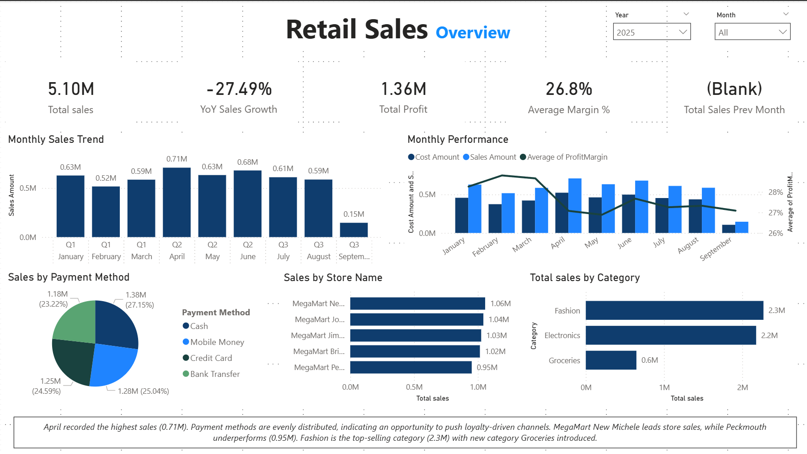

# Retail Sales Analytics (SQL + Power BI)

Retail analytics project analyzing **sales performance, customer behavior, product profitability, and store performance** using **SQL and Power BI**.

This project demonstrates a **typical Data Analyst workflow from raw data to business insights**.

---

# Project Architecture

```
Excel Dataset
      │
      ▼
SQL Data Cleaning & Validation
      │
      ▼
SQL Business Analysis
      │
      ▼
Power Query Data Transformation
      │
      ▼
DAX KPI Modeling
      │
      ▼
Power BI Interactive Dashboards
      │
      ▼
Business Insights
```

---

# Project Objective

The goal of this project is to simulate a **real-world retail analytics scenario** by:

- Cleaning and validating transactional data  
- Performing SQL-based business analysis  
- Transforming and modeling data for reporting  
- Developing interactive dashboards  
- Generating insights to support decision making  

---

# Dataset Structure

The dataset follows a **Star Schema design** with one **fact table** and three **dimension tables**.

---

# Fact Table

## Transactions

| Column | Description |
|------|-------------|
| TransactionID | Unique transaction identifier |
| Date | Transaction date |
| CustomerID | Customer reference |
| ProductID | Product reference |
| StoreID | Store reference |
| Quantity | Units purchased |
| Discount | Discount applied |
| PaymentMethod | Payment method |

---

# Dimension Tables

## Customers

| Column | Description |
|------|-------------|
| CustomerID | Unique customer identifier |
| FirstName | Customer first name |
| LastName | Customer last name |
| Gender | Gender |
| BirthDate | Date of birth |
| City | Customer city |
| JoinDate | Customer registration date |

---

## Products

| Column | Description |
|------|-------------|
| ProductID | Unique product identifier |
| ProductName | Product name |
| Category | Product category |
| SubCategory | Product subcategory |
| UnitPrice | Selling price |
| CostPrice | Product cost |

---

## Stores

| Column | Description |
|------|-------------|
| StoreID | Unique store identifier |
| StoreName | Store name |
| City | Store city |
| Region | Store region |

---

# Data Cleaning & Validation (SQL)

Before performing analysis, the dataset was validated to ensure reliability.

### Cleaning Checks

- Detecting **NULL values**
- Identifying **duplicate records**
- Validating **discount ranges**
- Checking **referential integrity** between fact and dimension tables

### Example Validation Query

```sql
SELECT *
FROM Transactions
WHERE Discount < 0 OR Discount > 1;
```

---

# SQL Business Analysis

SQL queries were used to analyze sales performance before building dashboards.

---

## Total Sales by Category

```sql
SELECT 
    p.Category,
    SUM(t.Quantity * p.UnitPrice * (1 - t.Discount)) AS TotalSales
FROM Transactions t
JOIN Products p
    ON t.ProductID = p.ProductID
GROUP BY p.Category
ORDER BY TotalSales DESC;
```

---

## Top Customers by Spending

```sql
SELECT 
    c.FirstName,
    c.LastName,
    SUM(t.Quantity * p.UnitPrice * (1 - t.Discount)) AS TotalSpent
FROM Transactions t
JOIN Customers c
    ON t.CustomerID = c.CustomerID
JOIN Products p
    ON t.ProductID = p.ProductID
GROUP BY c.FirstName, c.LastName
ORDER BY TotalSpent DESC;
```

---

## Store Revenue Performance

```sql
SELECT 
    s.StoreName,
    SUM(t.Quantity * p.UnitPrice * (1 - t.Discount)) AS StoreRevenue
FROM Transactions t
JOIN Products p
    ON t.ProductID = p.ProductID
JOIN Stores s
    ON t.StoreID = s.StoreID
GROUP BY s.StoreName
ORDER BY StoreRevenue DESC;
```

---

# Power BI Dashboards

Interactive dashboards were created to visualize key business metrics.

---

## Retail Sales Overview

Tracks overall performance including:

- Total Sales  
- Profit Margin  
- Year-over-Year Growth  
- Category Distribution  
- Payment Method Trends



---

## Customer Analytics

Focuses on customer behavior:

- Customer retention patterns  
- Average Order Value (AOV)  
- Customer segmentation  
- Geographic sales distribution  

---

## Product & Pricing Analysis

Analyzes product performance and pricing:

- Top-performing products  
- Category contribution  
- Discount vs profit relationship  
- Identification of low-margin products  

---

## Store Performance

Evaluates store and regional performance:

- Top performing stores  
- Regional sales comparison  
- Weekly sales trends  
- Category contribution by store  

---

# Key Business Insights

- Fashion and Electronics contribute the largest share of revenue.
- Higher discount levels tend to reduce product profitability.
- Repeat customers generate a significant portion of total sales.
- Certain stores consistently outperform others across categories.

---

# Tech Stack

- SQL
- Power BI
- DAX
- Power Query
- Star Schema Data Modeling

---

# Repository Structure

```
Retail-Sales-Analytics
│
├── README.md
│
├── SQL
│   ├── data_cleaning.sql
│   └── business_analysis.sql
│
├── PowerBI
│   └── Retail_Sales_Dashboard.pbix
│
└── Snapshots
    ├── sales_overview.png
    ├── customer_analytics.png
    ├── product_analysis.png
    └── store_performance.png
```

---

# What This Project Demonstrates

- Data cleaning and validation
- SQL joins and analytical queries
- Star schema data modeling
- KPI development using DAX
- Interactive data visualization
- Business insight generation

---

# Author

**Aniket Belhekar**  
Data Analyst | SQL | Power BI | Data Quality
